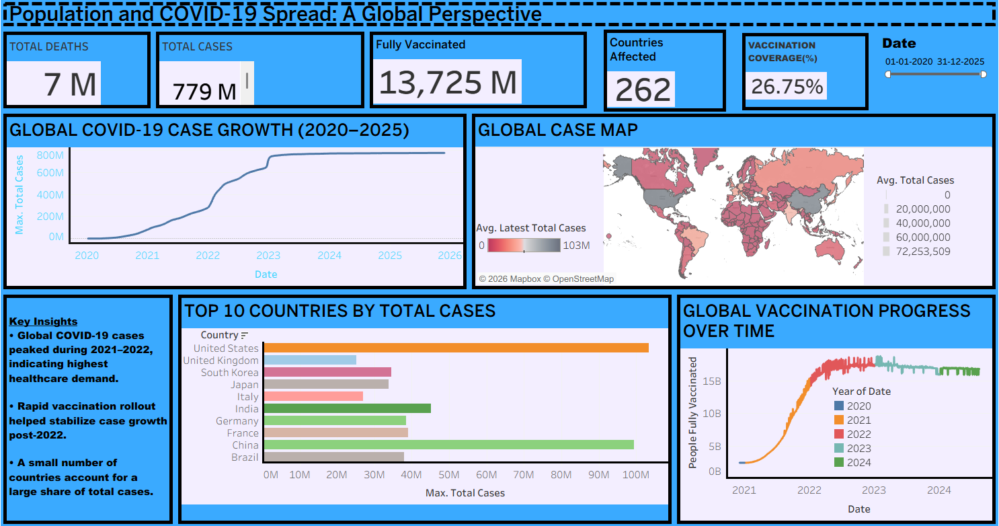

# 🌍 Global COVID-19 Analysis Dashboard (Tableau)

This project presents an interactive Tableau dashboard analyzing global COVID-19 trends from 2020 to 2025.  
It highlights case growth, geographic spread, country-wise impact, and vaccination progress.

## 📊 Dashboard Overview

## 🔍 Key Insights
- COVID-19 cases peaked during **2021–2022**, reflecting maximum global spread.
- A small number of countries account for a large proportion of total cases.
- Rapid vaccination rollout helped stabilize case growth after 2022.
- Vaccination coverage increased sharply between 2021 and 2023.

## 🛠 Tools & Technologies
- Tableau Public
- Data Visualization & Dashboard Design
- Time-series Analysis
- Geospatial Mapping

## 📁 Files Included
- `dashboard.png` – Dashboard preview image
- `COVID19_Dashboard.twbx` – Tableau packaged workbook
- `README.md` – Project documentation

### 👤 Author
**ANJAN ADITYA
